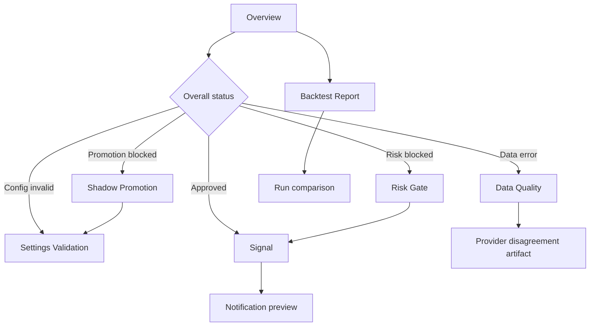

# Jayu Operations Console UX/UI Specification

## 1. Product Goal

Jayu Operations Console은 금융 리서치, 백테스트, 신호 생성 결과를 운영자가 빠르게
판단할 수 있게 만드는 데스크톱 우선 운영 화면이다. 화면의 핵심 질문은 세 가지다.

1. 이번 실행은 기술적으로 완료되었는가?
2. 데이터와 리스크 검증을 통과해 운영에 사용할 수 있는가?
3. 운영자가 지금 해야 할 다음 행동은 무엇인가?

실행 성공과 운영 승인은 분리해서 표시한다. 실행이 성공했더라도 데이터 불일치,
리스크 차단, promotion 미통과가 있으면 화면은 `운영 차단`을 우선 표시한다.

실제 주문 생성, 주문 제출, 체결 버튼은 제공하지 않는다.

## 2. Design Principles

| 원칙 | 적용 방식 |
|---|---|
| 5초 내 상태 인지 | 모드, 실행 상태, 운영 판정, 핵심 차단 사유를 첫 화면 상단에 고정 |
| 실패 우선 | 차단 및 데이터 오류 배너를 정상 지표보다 먼저 배치 |
| 판단 가능한 문장 | "불일치 3건" 대신 "SOXL 가격 불일치로 오늘 신호가 차단됨" 표시 |
| 현재값과 기준값 병기 | `현재 62% / 한도 40% / 초과 22%p` 형식 사용 |
| 근거 추적 | 모든 판정에서 원본 artifact, run ID, config/data hash로 이동 가능 |
| 고밀도 운영 UI | 표, 탭, 접이식 상세를 사용하고 장식성 카드와 대형 히어로는 배제 |
| 색상 외 중복 신호 | 아이콘, 라벨, 문장, 테두리를 함께 사용 |
| 안전한 CTA | 검증, 재실행, 리포트 확인, 알림만 제공하고 주문 CTA는 금지 |

## 3. Status Model

### 3.1 Separate Status Axes

화면은 다음 판정을 별도 필드로 유지한다.

| 축 | 값 | 설명 |
|---|---|---|
| `execution_status` | validating, success, warning, failed, data_error | 프로세스 실행 결과 |
| `safety_decision` | approved, review, blocked, not_evaluated | 운영 사용 가능 여부 |
| `publication_status` | pending, published, blocked, missing, invalid | 당일 신호 게시 상태 |
| `promotion_status` | eligible, blocked, not_required, not_evaluated | paper/live 승격 상태 |

상단 대표 상태는 다음 우선순위로 계산한다.

1. 데이터 계약 또는 provider 검증 실패: `데이터 오류`
2. safety decision이 blocked: `차단`
3. execution status가 failed: `실패`
4. 실행 중: `검증 중`
5. review 또는 경고 존재: `경고`
6. 모든 필수 검증 통과: `성공`

### 3.2 Operator Summary Sentence

대표 상태 아래에는 반드시 한 문장 요약을 제공한다.

예시:

- `실행은 완료됐지만 SOXL 데이터 불일치와 섹터 집중도 초과로 운영 신호가 차단됐습니다.`
- `Shadow 14일을 완료했습니다. Paper 승격까지 6일과 완료 신호 8건이 더 필요합니다.`
- `모든 필수 검증을 통과했습니다. 알림 전송 전 최종 리포트를 확인하세요.`

## 4. Information Architecture

```text
Jayu Operations Console
├─ Overview
├─ Runs
│  ├─ Run summary
│  └─ Artifact viewer
├─ Data Quality
├─ Backtest Report
├─ Signals
├─ Risk Gate
├─ Shadow Promotion
├─ Settings Validation
└─ System
   ├─ Health
   ├─ Failure history
   └─ Data source status
```

기본 좌측 내비게이션은 7개 필수 화면을 노출한다. `Runs`와 `System`은 보조 화면으로
두고, 현재 선택한 run ID와 실행 모드를 상단 컨텍스트 바에 고정한다.

## 5. Global Layout

### Desktop Shell

- 좌측 224px 내비게이션
- 상단 56px 컨텍스트 바
- 본문 최대 너비 제한 없이 12-column grid 사용
- 표 영역은 수평 스크롤을 허용하되 티커와 상태 열은 고정
- 모든 카드 radius는 8px 이하
- 위험 배너는 본문 첫 행 전체 너비 사용

### Persistent Context Bar

| 항목 | 표시 |
|---|---|
| 실행 모드 | `LIVE`, `SHADOW` 등 대문자 모드 배지 |
| Run | run ID 선택 콤보박스 |
| 실행 시각 | 절대 시각과 상대 경과 시간 |
| 대표 상태 | 상태 아이콘과 텍스트 |
| Freshness | 최신 데이터 기준 시각, stale 여부 |
| Hash | config/data/signal hash 축약값, 클릭 시 전체값 |
| Refresh | 읽기 전용 새로고침 버튼 |

## 6. Screen Specifications

## 6.1 Overview

### 화면 목적

현재 운영 상태와 차단 원인, 오늘의 신호, 다음 행동을 한 화면에서 판단한다.

### 사용자가 즉시 알아야 할 정보

- 현재 모드와 마지막 실행 시각
- 실행 성공 여부와 운영 승인 여부
- 데이터, survivorship, risk, promotion 네 게이트 상태
- 승인, 제외, 차단 신호 수
- 가장 중요한 경고 세 건
- 운영 지속, 중단, 재검증 중 어떤 행동이 필요한지

### 상단 요약 카드

| 카드 | 내용 |
|---|---|
| 전체 판정 | 대표 상태, 자연어 요약, failure code |
| 데이터 검증 | 성공 ticker/전체 ticker, provider 수, disagreement 수 |
| 리스크 게이트 | 승인/차단 수, 최상위 reason code |
| Shadow promotion | 진행 일수/필요일, eligible 여부 |
| 오늘의 신호 | 매수 후보/제외/차단 수 |
| Health | 0-100 점수, 기준 점수, 최근 실패 여부 |

차단 시 카드 위에 전체 너비 critical banner를 표시한다. 배너에는 첫 번째 차단
사유, 영향받은 ticker 수, 상세 보기 CTA를 둔다.

### 주요 테이블

`중요 경고` 표:

| Severity | Code | 판단 문장 | 영향 대상 | 현재/기준 | Action |
|---|---|---|---|---|---|

`오늘의 신호 요약` 표:

| Ticker | Action | Status | Score | Entry | Risk | Data verified |
|---|---|---|---:|---:|---|---|

### 주요 차트

- 최근 30회 health score sparkline
- 최근 20일 승인/차단 신호 수 stacked bar
- 데이터 검증 성공률과 disagreement 비율 dual-line trend

Overview에서는 전체 equity curve를 표시하지 않는다. 성과 해석은 Backtest Report로
분리한다.

### 상태별 표시 방식

- 성공: `운영 검토 가능` 문장과 녹색 check 아이콘
- 경고: 상단 amber 배너, 경고 수 표시
- 실패: 실행 실패 원인과 마지막 성공 run 링크
- 차단: 가장 높은 우선순위 차단 사유를 최상단 고정
- 검증 중: 진행 단계와 마지막 heartbeat 표시
- 데이터 오류: affected ticker와 provider를 즉시 노출

### CTA 버튼

- `설정 검증`
- `데이터 재검증`
- `리스크 상세`
- `Shadow 기간 확인`
- `전체 리포트`
- `알림 미리보기`
- `알림 전송`은 live, approved, published, health 통과 시에만 활성화
- `운영 중단 권장`은 명령 버튼이 아니라 명확한 권고 상태로 표시

### 필요한 데이터 필드

`run_id`, `mode`, `started_at`, `finished_at`, `execution_status`,
`safety_decision`, `publication_status`, `health_score`, `health_threshold`,
`data_validation_rate`, `provider_count`, `disagreement_count`,
`survivorship_status`, `risk_approved_count`, `risk_blocked_count`,
`promotion_eligible`, `shadow_days`, `signal_counts`, `top_reasons`,
`recommended_actions`, `config_hash`, `data_hash`, `signal_hash`.

### 비정상 상태 처리

- 최신 run이 없으면 설정 검증 CTA만 활성화한다.
- run이 stale이면 이전 상태를 회색 처리하고 `최신 결과가 아님` 배너를 표시한다.
- 일부 artifact 누락 시 전체 성공으로 보이지 않도록 `검증 불완전` 상태로 강등한다.
- status API와 artifact hash가 충돌하면 `데이터 오류`로 표시한다.

### 접근성 고려사항

- 대표 상태를 색상만으로 전달하지 않고 아이콘, 라벨, 문장을 함께 제공한다.
- 자동 갱신 결과는 `aria-live="polite"`로 알리되 focus를 이동시키지 않는다.
- critical banner는 페이지 제목 다음 첫 focus target이 된다.
- 차트 정보는 동일 내용을 담은 요약 표를 제공한다.

## 6.2 Data Quality

### 화면 목적

가격 provider 검증 결과와 불일치 근거를 ticker, 날짜, 필드 단위로 조사한다.

### 사용자가 즉시 알아야 할 정보

- 검증에 사용된 provider와 성공/실패 상태
- 전체 검증 성공률
- 차단된 ticker와 원인
- 가격, 거래량, 날짜 인덱스 불일치 규모
- 현재 임계값 대비 최대 오차

### 상단 요약 카드

| 카드 | 내용 |
|---|---|
| 검증 성공률 | 성공 ticker/전체 ticker 및 백분율 |
| Provider 상태 | provider별 성공, 실패, 응답 지연 |
| 가격 불일치 | 건수, 최대 상대 오차, 허용치 |
| 거래량 불일치 | 건수, 최대 상대 오차, 허용치 |
| 날짜 불일치 | 누락/추가 일자 수, 허용치 |
| 신호 차단 | 차단 ticker 수와 policy |

### 주요 테이블

`Provider 비교`:

| Ticker | Provider | Status | Rows | First | Last | Hash | Error |
|---|---|---|---:|---|---|---|---|

`불일치 상세`:

| Severity | Ticker | Date | Field | Provider A | Value A | Provider B | Value B | Delta | Limit | Cause |
|---|---|---|---|---|---:|---|---:|---:|---:|---|

`누락 일자`:

| Ticker | Provider | Missing date | Peer providers | Trading day | Blocked |
|---|---|---|---|---|---|

필터: provider, ticker, field, severity, blocked only. 검색과 열 정렬을 제공한다.

### 주요 차트

- ticker별 close 상대 오차 heatmap
- provider별 검증 성공률 bar
- 최근 30회 disagreement rate trend
- 날짜별 누락 관측치 matrix

### 상태별 표시 방식

- 임계값 이내 차이는 neutral 정보로 표시
- 임계값 80% 이상은 warning
- 임계값 초과는 failed
- `price_usable=false` 또는 strict 실패는 blocked 라벨 추가

### CTA 버튼

- `실패 ticker만 보기`
- `Provider report JSON`
- `Data quality artifact`
- `데이터 재검증`
- `설정 임계값 확인`

### 필요한 데이터 필드

`provider`, `category`, `ticker`, `status`, `rows`, `first_date`, `last_date`,
`hash`, `error`, `agreed`, `price_verified`, `price_usable`,
`provider_pairs`, `date_mismatches`, `value_mismatches`, `field`,
`date`, `values_by_provider`, `relative_delta`, `threshold`, `cause`,
`blocking`, `verification_signature`.

### 비정상 상태 처리

- provider 하나만 성공하면 strict operational mode에서는 즉시 차단 상태로 표시한다.
- 비교 대상이 없으면 성공률을 100%로 계산하지 않고 `검증 불가`로 표시한다.
- provider 응답 실패와 정상 응답 후 값 불일치를 서로 다른 오류로 표시한다.
- report 파일이 손상되면 원본 경로와 파싱 오류를 제공한다.

### 접근성 고려사항

- heatmap 셀에 숫자와 상태 텍스트를 함께 제공한다.
- 표의 상태 아이콘에 접근 가능한 이름을 제공한다.
- 긴 hash와 오류 메시지는 keyboard focus 가능한 popover로 전체 표시한다.

## 6.3 Backtest Report

### 화면 목적

전략 성과가 비용, OOS, 선택 편향, lockbox 검증 이후에도 유지되는지 판단한다.

### 사용자가 즉시 알아야 할 정보

- 누적 수익률과 MDD
- Sharpe, 승률, 거래 수
- PSR, DSR, PBO 통과 여부
- OOS 성과와 train 대비 decay
- final lockbox 승인 여부와 retention
- 비용 증가 후 전략 생존 여부

### 상단 요약 카드

| 카드 | 현재값과 기준 |
|---|---|
| 누적 수익률 | net return, benchmark 대비 |
| MDD | 현재 MDD / 최대 허용 MDD |
| Sharpe | OOS Sharpe / 승인 기준 |
| PSR | 현재 / 최소 기준 |
| DSR | 현재 / 최소 기준 |
| PBO | 현재 / 최대 기준 |
| OOS retention | OOS/train / 최소 기준 |
| Lockbox | approved, retention, reused |

### 주요 테이블

`전략 비교`:

| Ticker | Regime | Strategy | Return | MDD | Win rate | Sharpe | Trades | Cost survival | Status |
|---|---|---|---:|---:|---:|---:|---:|---|---|

`OOS fold`:

| Fold | Train range | Test range | Return | MDD | Sharpe | PSR | Approved | Reasons |
|---|---|---|---:|---:|---:|---:|---|---|

`과최적화 검증`:

| Ticker | Regime | PSR | DSR | PBO | Candidates | Lockbox retention | Decision |
|---|---|---:|---:|---:|---:|---:|---|

### 주요 차트

- equity curve와 benchmark
- underwater drawdown chart
- OOS fold return bar
- train/OOS/lockbox 성과 grouped bar
- 비용 bps별 net return sensitivity line
- parameter importance horizontal bar

차트 툴팁에는 날짜, 현재값, benchmark, drawdown을 함께 표시한다.

### 상태별 표시 방식

- 수익률이 양수여도 DSR/PBO/lockbox 실패 시 `검증 실패`로 표시한다.
- lockbox 재사용은 오류가 아니지만 `reused` 라벨과 ledger 링크를 노출한다.
- 거래 수 부족으로 통계가 계산되지 않으면 `근거 부족`으로 표시한다.
- 비용 민감 전략은 `COST_FRAGILE`을 성과 카드 상단에 표시한다.

### CTA 버튼

- `검증 실패만 보기`
- `비용 민감도 보기`
- `Run 비교`
- `Markdown 리포트`
- `JSON 다운로드`
- `Artifact 폴더 열기`

### 필요한 데이터 필드

`strategy_id`, `ticker`, `regime`, `strategy_mode`, `period`,
`total_return`, `net_return`, `benchmark_return`, `max_drawdown`,
`win_rate`, `sharpe`, `trade_count`, `equity_points`, `drawdown_points`,
`oos_folds`, `psr`, `dsr`, `pbo`, `candidate_count`, `train_fitness`,
`oos_fitness`, `fitness_retention`, `final_lockbox`, `cost_sensitivity`,
`parameter_importance`, `approval_thresholds`, `reason_codes`.

### 비정상 상태 처리

- equity artifact가 없으면 표 지표는 유지하고 차트 자리에 누락 이유를 표시한다.
- 지표가 NaN 또는 무한대이면 숫자로 렌더링하지 않고 `계산 불가`로 표시한다.
- train만 있고 OOS가 없으면 전략을 승인 상태로 표시하지 않는다.
- 서로 다른 config/data hash의 전략 비교 시 비교 경고를 표시한다.

### 접근성 고려사항

- 선 색상 외에 dash pattern과 point marker를 함께 사용한다.
- chart keyboard navigation과 데이터 표 전환을 제공한다.
- 퍼센트와 확률은 시각적으로 유사하지 않게 단위를 명시한다.

## 6.4 Signal

### 화면 목적

당일 신호의 행동, 가격 수준, 데이터 신뢰도, 리스크 승인 여부를 종목별로 확인한다.

### 사용자가 즉시 알아야 할 정보

- 매수, 제외, 차단 후보 수
- 신호 게시 상태와 signal hash
- 데이터 검증이 끝난 신호인지
- 진입가, 손절가, 목표가
- confidence와 전략명
- 리스크 차단 여부와 이유

### 상단 요약 카드

| 카드 | 내용 |
|---|---|
| 게시 상태 | pending/published/blocked/invalid |
| 매수 후보 | eligible buy 수 |
| 차단 후보 | blocked buy 수 |
| Hold/제외 | hold 또는 not applicable 수 |
| 데이터 검증 | verified 신호/전체 신호 |
| 신호 무결성 | signal hash 검증 결과 |

### 주요 테이블

| Ticker | Status | Action | Strategy | Confidence | Entry | Stop | Target | Position | Liquidity | Data | Reasons |
|---|---|---|---|---:|---:|---:|---:|---:|---|---|---|

행 확장 영역:

- 조건별 통과/실패
- provider와 data hash
- risk pass/fail details
- news/event risk notes
- shadow 상태와 future return

### 주요 차트

- 선택 ticker의 최근 가격과 entry/stop/target 수평선
- confidence 구성 요소 bar
- 최근 20일 신호 상태 timeline

### 상태별 표시 방식

- eligible buy: `검토 가능`
- hold: `대기`
- blocked: reason code와 첫 자연어 설명 표시
- data unverified: action과 무관하게 데이터 오류 강조
- publication invalid: 전체 표를 읽기 전용 dim 처리하고 운영 사용 금지 배너 표시

### CTA 버튼

- `차단 후보만 보기`
- `데이터 근거`
- `리스크 근거`
- `신호 JSON`
- `알림 미리보기`
- `알림 전송`은 안전 조건 충족 시에만 제공

주문, 매수, 매도, 포지션 실행 CTA는 제공하지 않는다.

### 필요한 데이터 필드

`signal_date`, `ticker`, `signal`, `action`, `status`, `eligible`,
`blocked`, `strategy_id`, `strategy_mode`, `confidence_score`,
`confidence_components`, `entry_price`, `stop_price`, `target_price`,
`suggested_position_pct`, `approved_position_pct`, `liquidity_status`,
`data_verified`, `provider_sources`, `reason_codes`, `reason_details`,
`risk_notes`, `shadow_status`, `future_return_1d`, `future_return_5d`,
`future_return_20d`, `signal_hash`, `content_hash`.

### 비정상 상태 처리

- stop 또는 target이 없으면 `미계산`으로 표시하고 0으로 대체하지 않는다.
- signal hash 불일치 시 `SIGNAL_PUBLICATION_INVALID`로 전체 운영 사용을 차단한다.
- signal 날짜가 오늘과 다르면 stale 배너를 표시한다.
- 데이터 검증 없이 eligible인 신호는 UI에서도 강제로 blocked representation을 사용한다.

### 접근성 고려사항

- 가격의 소수점 자릿수와 통화를 일관되게 표시한다.
- status와 action을 혼동하지 않도록 별도 열과 별도 accessible label을 사용한다.
- 행 확장은 키보드와 screen reader에서 동일하게 접근 가능해야 한다.

## 6.5 Risk Gate

### 화면 목적

포트폴리오 위험 심사의 통과 여부와 차단 근거를 현재값, 한도, 초과값으로 설명한다.

### 사용자가 즉시 알아야 할 정보

- 전체 risk status
- 승인/차단 신호 수
- 가장 빈번한 reason code
- 최대 종목 수, 단일 종목 비중, 섹터 집중도, 현금 비중
- 유동성, 미매핑 ticker, 최근 손실 한도 상태

### 상단 요약 카드

| 카드 | 현재값 / 기준값 |
|---|---|
| 종목 수 | current / max |
| 최대 단일 비중 | current / max |
| 최대 섹터 집중도 | current / max |
| 현금 비중 | current / minimum |
| 최근 손실 | daily, weekly, monthly / limits |
| 미매핑 ticker | count / required 0 |

### 주요 테이블

`게이트별 판정`:

| Status | Metric | Current | Limit | Excess/Buffer | Affected tickers | Reason code |
|---|---|---:|---:|---:|---|---|

`종목별 판정`:

| Ticker | Requested | Approved | Resized | Liquidity | Mapping | Status | Reason codes |
|---|---:|---:|---|---|---|---|---|

reason code를 선택하면 자연어 설명, 계산식, 관련 설정 경로, 영향 범위를 우측
detail panel에 표시한다.

### 주요 차트

- 종목별 requested/approved position 비교 bar
- 섹터별 exposure와 limit bullet chart
- cash/invested 비중 stacked bar
- 최근 손익과 daily/weekly/monthly limit trend

### 상태별 표시 방식

- pass: 남은 buffer 표시
- resized: warning으로 표시하고 변경 전후 비중 병기
- blocked: reason code와 초과값 강조
- not evaluated: 성공으로 표시하지 않고 회색 `미검증`

### CTA 버튼

- `차단 사유만 보기`
- `설정 한도 확인`
- `Signal 화면`
- `Risk JSON`
- `운영 중단 권장 사유`

리스크 한도 즉시 수정 버튼은 제공하지 않는다. Settings Validation으로 이동해 변경
영향과 권장값을 먼저 확인한다.

### 필요한 데이터 필드

`portfolio_value`, `cash_pct`, `invested_pct`, `position_count`,
`position_exposures`, `sector_exposures`, `liquidity_metrics`,
`unmapped_tickers`, `daily_loss`, `weekly_loss`, `monthly_drawdown`,
`limits`, `passed`, `failed`, `observed`, `limit`, `excess`,
`approved_position_pct`, `requested_position_pct`, `resized`,
`reason_codes`, `warnings`.

### 비정상 상태 처리

- portfolio snapshot 계약 실패 시 모든 risk 결과를 `검증 불가`로 처리한다.
- account value 또는 cash가 누락되면 현금 관련 gate를 통과로 간주하지 않는다.
- 같은 ticker에 여러 reason code가 있으면 severity 순으로 정렬한다.
- 미매핑 ticker가 있으면 직접 검색 가능한 필터를 자동 적용한다.

### 접근성 고려사항

- `current`, `limit`, `excess` 열의 읽기 순서를 고정한다.
- bullet chart와 동일한 수치를 표로 제공한다.
- reason code 약어에는 전체 설명을 tooltip과 detail panel에 제공한다.

## 6.6 Shadow Promotion

### 화면 목적

Shadow 운영 근거가 paper 또는 live 성격 운영으로 승격하기 충분한지 설명한다.

### 사용자가 즉시 알아야 할 정보

- 총 shadow 실행 일수와 최소 기준
- 완료 신호 수와 성숙도
- 데이터 검증 성공률
- provider disagreement 비율
- risk gate 통과율
- 신호 수 안정성
- paper/live 승격 가능 여부

### 상단 요약 카드

| 카드 | 현재값 / 기준값 |
|---|---|
| Shadow 일수 | current / minimum |
| 완료 신호 | completed / minimum |
| 데이터 검증률 | current / minimum |
| Disagreement 비율 | current / maximum |
| Risk 통과율 | current / minimum |
| 신호 변동률 | current / maximum |

상단 판정은 `Paper 승격 가능`, `Live 성격 운영 가능`, `승격 차단`을 별도로 표시한다.

### 주요 테이블

`승격 조건`:

| Criterion | Status | Current | Required | Gap | Remediation |
|---|---|---:|---:|---:|---|

`Shadow 실행 이력`:

| Date | Run | Signals | Completed | Data valid | Disagreements | Risk pass | Health |
|---|---|---:|---:|---:|---:|---:|---:|

### 주요 차트

- 최근 N일 data validation rate
- risk gate pass rate
- 일별 signal count와 최대 변동 범위
- 1d/5d/20d future return 분포
- shadow day completion progress

### 상태별 표시 방식

- 기준 통과: 현재값과 확보한 buffer 표시
- 근접: 기준의 90% 이상이면 warning
- 실패: 부족량을 `6일 부족`, `8건 부족`처럼 표시
- critical data failure 존재: 다른 조건과 무관하게 blocked

### CTA 버튼

- `부족 조건만 보기`
- `Shadow 실행 이력`
- `Data Quality 확인`
- `Risk Gate 확인`
- `Promotion JSON`
- `Shadow 계속 운영` 안내

실제 모드 승격 버튼은 1차 버전에서 제공하지 않는다. 승인 가능 상태와 필요한
config 변경 절차만 안내한다.

### 필요한 데이터 필드

`generated_at`, `eligible`, `paper_eligible`, `live_eligible`,
`shadow_days`, `buy_signal_count`, `mature_signal_count`,
`completed_signal_count`, `critical_failures`, `metrics`,
`criteria[].name`, `criteria[].passed`, `criteria[].observed`,
`criteria[].required`, `daily_history`, `future_return_summary`,
`failure_code`, `recommended_actions`.

### 비정상 상태 처리

- shadow 파일이 없으면 `0일`과 `데이터 없음`을 구분해 표시한다.
- 날짜 형식이 잘못된 파일은 무시하지 말고 invalid artifact 수를 표시한다.
- 미래 수익률이 아직 성숙하지 않은 신호는 실패가 아닌 pending으로 표시한다.
- health 파일 누락 시 승격 불가로 처리한다.

### 접근성 고려사항

- progress bar에 현재값과 목표값 텍스트를 함께 제공한다.
- pass/fail icon에 동일한 라벨을 제공한다.
- 날짜 추세 차트는 표 보기로 전환할 수 있어야 한다.

## 6.7 Settings Validation

### 화면 목적

현재 설정이 선택한 실행 모드에 안전하고 충분한지 검증하고 수정 권장값을 제시한다.

### 사용자가 즉시 알아야 할 정보

- 선택 모드와 validation 결과
- 필수 설정 누락
- unsafe 설정
- 현재값과 안전 권장값
- 변경 시 영향을 받는 게이트

### 상단 요약 카드

| 카드 | 내용 |
|---|---|
| 설정 상태 | safe, warning, unsafe, invalid |
| 실행 모드 | research/backtest/signal/shadow/paper/live |
| Provider 검증 | provider 수, strict 여부 |
| Universe | policy, includes_delisted |
| Promotion | enabled, eligible |
| Secret 상태 | key 존재 여부만 표시, 값은 절대 표시 금지 |

### 주요 테이블

| Category | Setting | Current | Required/Recommended | Status | Impact | Source |
|---|---|---|---|---|---|---|

필터: errors only, unsafe only, category, execution mode.

모드 탭:

- Research
- Backtest
- Signal
- Shadow
- Paper
- Live

각 탭은 해당 모드에서만 필수인 규칙을 표시한다.

### 주요 차트

설정 화면은 차트를 사용하지 않는다. 대신 validation rule coverage와 category별
오류 수를 compact bar로 표시한다.

### 상태별 표시 방식

- valid safe: 녹색
- valid but risky: amber
- invalid: red
- live에서 허용되지 않는 값: blocked
- secret: `configured` 또는 `missing`만 표시

### CTA 버튼

- `설정 다시 검증`
- `Sample config 비교`
- `권장값만 보기`
- `Config diff`
- `관련 문서`

1차 버전은 설정 파일을 UI에서 직접 저장하지 않는다. 변경할 경로와 권장 JSON
snippet을 제공하고 재검증한다.

### 필요한 데이터 필드

`mode`, `safety_profile`, `valid`, `rules`, `path`, `category`,
`current_value`, `required_value`, `recommended_value`, `severity`,
`message`, `impact`, `reason_code`, `source`, `secret_configured`,
`provider_audit`, `survivorship_audit`, `promotion_audit`,
`strategy_space_audit`.

### 비정상 상태 처리

- config parse 실패 시 가능한 line/column과 schema message를 표시한다.
- 환경변수와 config 값이 다르면 실제 적용값의 source를 표시한다.
- secret 값은 API 응답, 로그, 화면에 포함하지 않는다.
- mode를 변경하면 저장하지 않고 validation preview만 다시 계산한다.

### 접근성 고려사항

- config path를 code semantics로 읽도록 표시한다.
- diff는 추가/삭제 색상 외에 `추가`, `제거`, `변경` 라벨을 제공한다.
- 오류 첫 항목으로 이동하는 skip link를 제공한다.

## 7. Navigation Flow



모든 상세 화면의 breadcrumb에는 `Run ID > Screen`을 표시하며 Overview로 돌아갈 수
있다. ticker를 선택하면 Data Quality, Signal, Risk Gate에서 동일 ticker 필터를
유지한다.

## 8. Component Inventory

### Shell

- `AppSidebar`
- `RunContextBar`
- `RunSelector`
- `ModeBadge`
- `FreshnessIndicator`
- `HashPopover`

### Status

- `OverallStatusBanner`
- `StatusBadge`
- `GateStatus`
- `MetricThreshold`
- `ReasonCodeBadge`
- `ReasonDetailPanel`
- `HealthScore`
- `ProgressCriterion`

### Data Display

- `DataTable`
- `ColumnFilter`
- `TickerSearch`
- `ArtifactLink`
- `JsonViewer`
- `MetricDefinitionTooltip`
- `EmptyState`
- `ErrorState`
- `StaleDataBanner`

### Charts

- `EquityCurveChart`
- `DrawdownChart`
- `FoldPerformanceChart`
- `ProviderDeltaHeatmap`
- `ThresholdBulletChart`
- `PromotionTrendChart`
- `SignalCountChart`
- `CostSensitivityChart`
- `ParameterImportanceChart`

### Actions

- `ValidateConfigButton`
- `RevalidateDataButton`
- `OpenReportButton`
- `NotificationPreviewButton`
- `SendNotificationButton`
- `CopyCommandButton`

## 9. State Color System

| 상태 | Foreground | Background | Icon | Label |
|---|---|---|---|---|
| 성공 | `#126B45` | `#E8F5EE` | check-circle | 성공 |
| 경고 | `#8A4B08` | `#FFF3D6` | triangle-alert | 경고 |
| 실패 | `#B42318` | `#FEECEB` | circle-x | 실패 |
| 차단 | `#7A1F45` | `#FBEAF2` | shield-x | 차단 |
| 검증 중 | `#175CD3` | `#EAF2FF` | loader | 검증 중 |
| 데이터 오류 | `#9A3412` | `#FFF0E8` | database-zap | 데이터 오류 |
| 미검증 | `#475467` | `#F2F4F7` | circle-help | 미검증 |

텍스트 대비는 WCAG AA 4.5:1 이상을 유지한다. 색상은 아이콘, 라벨, 테두리,
자연어 설명과 항상 함께 사용한다.

## 10. API Design

현재 Jayu는 artifact 중심 CLI이므로 프론트엔드가 파일을 직접 읽지 않게 read-only
API adapter를 추가한다. adapter는 artifact allowlist와 schema validation을 적용한다.

### Recommended Endpoints

| Method | Endpoint | Purpose |
|---|---|---|
| GET | `/api/v1/overview?run_id=latest` | 집계 운영 상태 |
| GET | `/api/v1/runs` | run 목록과 필터 |
| GET | `/api/v1/runs/{run_id}` | run metadata |
| GET | `/api/v1/runs/{run_id}/data-quality` | provider 검증 |
| GET | `/api/v1/runs/{run_id}/backtest` | 성과와 검증 |
| GET | `/api/v1/runs/{run_id}/signals` | 신호 목록 |
| GET | `/api/v1/runs/{run_id}/risk` | risk explanation |
| GET | `/api/v1/promotion` | promotion 상태와 이력 |
| GET | `/api/v1/settings/validation?mode=live` | 모드별 설정 검증 |
| GET | `/api/v1/failure-codes` | code 설명 카탈로그 |
| GET | `/api/v1/artifacts/{run_id}/{name}` | allowlisted JSON/Markdown |
| POST | `/api/v1/actions/validate-config` | 설정 검증 job |
| POST | `/api/v1/actions/revalidate-data` | 데이터 검증 job |
| POST | `/api/v1/notifications/preview` | 알림 미리보기 |
| POST | `/api/v1/notifications/send` | 승인 조건 충족 시 알림 전송 |

주문 관련 endpoint는 만들지 않는다.

### Overview Response Example

```json
{
  "schema_version": "1.0",
  "generated_at": "2026-06-14T11:40:00+09:00",
  "run": {
    "run_id": "20260614_113000_signal_SOXL-TQQQ_seed42",
    "mode": "shadow",
    "execution_status": "success",
    "started_at": "2026-06-14T11:30:00+09:00",
    "finished_at": "2026-06-14T11:34:18+09:00",
    "freshness": {"status": "fresh", "age_minutes": 6},
    "config_hash": "a8f31c...",
    "data_hash": "42c09e...",
    "signal_hash": "b5a77d..."
  },
  "decision": {
    "overall": "blocked",
    "headline": "실행은 완료됐지만 2개 신호가 리스크 게이트에서 차단됐습니다.",
    "top_reasons": [
      {
        "code": "SECTOR_EXPOSURE_EXCEEDED",
        "message": "반도체 섹터 비중이 한도를 초과했습니다.",
        "severity": "blocking",
        "affected_tickers": ["SOXL", "NVDL"],
        "current": 0.62,
        "limit": 0.4,
        "excess": 0.22
      }
    ]
  },
  "gates": {
    "data": {"status": "pass", "verified": 6, "total": 6, "disagreements": 0},
    "survivorship": {"status": "pass", "policy": "strict", "includes_delisted": true},
    "risk": {"status": "blocked", "approved": 1, "blocked": 2},
    "promotion": {"status": "warning", "eligible": false, "shadow_days": 14}
  },
  "signals": {"buy": 3, "eligible": 1, "blocked": 2, "hold": 3},
  "health": {"score": 88, "threshold": 80, "status": "healthy"},
  "recommended_actions": [
    {
      "id": "review-risk",
      "label": "리스크 상세 확인",
      "route": "/runs/20260614_113000_signal_SOXL-TQQQ_seed42/risk",
      "priority": 1
    }
  ]
}
```

## 11. JSON Data Model

```json
{
  "schema_version": "1.0",
  "run_id": "string",
  "mode": "research|backtest|signal|shadow|paper|live",
  "execution_status": "validating|success|warning|failed|data_error",
  "safety_decision": "approved|review|blocked|not_evaluated",
  "summary": {
    "headline": "string",
    "severity": "success|warning|failed|blocked|data_error",
    "reason_codes": ["DATA_DISAGREEMENT"],
    "recommended_actions": []
  },
  "metrics": [
    {
      "key": "sector_exposure",
      "label": "섹터 집중도",
      "value": 0.62,
      "threshold": 0.4,
      "comparison": "lte",
      "unit": "ratio",
      "status": "blocked",
      "excess": 0.22
    }
  ],
  "reasons": [
    {
      "code": "SECTOR_EXPOSURE_EXCEEDED",
      "message": "반도체 섹터 비중이 한도를 초과했습니다.",
      "severity": "blocking",
      "component": "risk",
      "affected_tickers": ["SOXL", "NVDL"],
      "observed": 0.62,
      "limit": 0.4,
      "excess": 0.22,
      "remediation": "포지션 비중 또는 섹터 한도를 검토하세요.",
      "artifact": "risk_explanation.json"
    }
  ],
  "provenance": {
    "config_hash": "string",
    "data_hash": "string",
    "signal_hash": "string",
    "artifact_hashes": {},
    "generated_at": "ISO-8601",
    "timezone": "Asia/Seoul"
  }
}
```

### Data Model Changes Required

| 변경 | 이유 |
|---|---|
| `schema_version` 공통 추가 | 프론트와 artifact 호환성 관리 |
| 실행 상태와 safety decision 분리 | 성공 실행과 운영 차단 혼동 방지 |
| 공통 `MetricThreshold` 구조 | 현재값, 기준값, 초과값 일관 표시 |
| failure code catalog | 코드와 자연어 설명, remediation 연결 |
| signal 가격 필드 표준화 | `entry_price`, `stop_price`, `target_price` 보장 |
| `confidence_score` 정의 | 점수 범위와 구성 요소 설명 |
| liquidity 상태 표준화 | pass/warn/fail과 근거 값 제공 |
| promotion daily history | 최근 N일 추세 시각화 |
| settings validation artifact 저장 | CLI 출력이 아닌 UI API 제공 |
| artifact별 hash와 freshness | 손상, stale, run 혼합 방지 |

## 12. Empty States

| 화면 | 빈 상태 문장 | Primary CTA |
|---|---|---|
| Overview | `아직 완료된 실행이 없습니다.` | 설정 검증 |
| Data Quality | `이 run에는 provider 비교 결과가 없습니다.` | Provider 설정 확인 |
| Backtest | `백테스트 artifact가 생성되지 않았습니다.` | Research run 확인 |
| Signal | `선택한 날짜에 생성된 신호가 없습니다.` | Run 목록 |
| Risk Gate | `심사할 매수 신호가 없어 리스크 게이트가 실행되지 않았습니다.` | Signal 확인 |
| Promotion | `Shadow 실행 이력이 없습니다.` | Shadow 실행 절차 |
| Settings | `검증 결과가 아직 생성되지 않았습니다.` | 설정 검증 |

빈 상태는 성공으로 보이지 않게 `미검증` 상태를 사용한다.

## 13. Error States

### Full-page Error

- API 연결 실패
- schema version 미지원
- 선택 run이 삭제됨
- artifact 전체 접근 실패

표시 내용:

- 사람이 이해할 수 있는 오류 제목
- failure code
- 발생 시각
- 마지막 정상 snapshot
- 재시도 CTA
- 로그 또는 artifact 위치

### Section Error

다른 section은 정상인데 특정 artifact만 실패한 경우 해당 section만 오류 상태로
표시한다. Overview 대표 상태는 필수 artifact 누락 여부에 따라 warning 또는 blocked로
강등한다.

### Stale State

stale 데이터는 마지막 값을 유지하되:

- 상단에 `최신 상태 아님` 표시
- 마지막 성공 시각 표시
- 자동 갱신 실패 이유 표시
- 알림 전송 CTA 비활성화

## 14. Frontend Architecture

### Recommended Stack

- React + TypeScript
- Vite
- TanStack Router
- TanStack Query
- TanStack Table
- Apache ECharts 또는 Recharts
- Zod response validation
- CSS variables 기반 design tokens
- Lucide icons
- Vitest + Testing Library
- Playwright

프론트엔드는 `web/` 독립 workspace로 두고 Python 패키지와 build lifecycle을 분리한다.
초기 버전은 polling 기반 read-only console로 시작한다.

### State Strategy

- 서버 상태: TanStack Query
- URL 상태: run ID, ticker, filters, tab
- 로컬 상태: table column, expanded rows
- 판정 로직: 백엔드에서 계산하고 프론트는 재계산하지 않음
- API 응답은 Zod로 검증하고 실패 시 schema error 표시

## 15. Implementation Priority

### P0

1. 공통 status model과 read-only API adapter
2. Overview
3. Data Quality
4. Risk Gate
5. Signal
6. failure code catalog와 reason detail

### P1

1. Shadow Promotion
2. Settings Validation
3. Backtest Report 핵심 차트
4. Run selector와 artifact provenance
5. 알림 미리보기

### P2

1. Run comparison
2. provider 품질 trend
3. failure reason trend
4. parameter importance interaction
5. notification send workflow

가장 먼저 구현할 vertical slice는 `Overview -> Data Quality -> Risk Gate`다. 운영 차단
판정과 근거 추적을 먼저 완성한 뒤 성과 시각화를 추가한다.

## 16. Test Scenarios

### Unit

- 대표 상태 우선순위 계산
- current/limit/excess formatting
- failure code와 자연어 설명 mapping
- hash 축약 및 전체값 표시
- stale 판정
- secret redaction
- NaN/Infinity 안전 표시

### Component

- blocked banner가 성공 카드보다 먼저 보이는지
- 데이터 표 정렬, 검색, 필터
- reason code detail panel
- chart empty/error/loading states
- CTA enabled/disabled 조건
- keyboard table navigation

### Integration

- Overview에서 Data Quality로 ticker filter 전달
- risk reason에서 관련 signal로 이동
- 다른 run 선택 시 모든 화면 context 갱신
- config/data hash가 다른 artifact 혼합 차단
- schema validation 실패 처리

### End-to-End

1. 정상 shadow run에서 warning과 남은 promotion 조건 확인
2. provider disagreement run에서 데이터 오류와 ticker 차단 확인
3. risk blocked run에서 reason code, 현재값, 한도, 초과값 확인
4. approved live run에서 알림 미리보기 활성화 확인
5. signal hash 변조 시 알림 전송 비활성화 확인
6. stale run에서 마지막 결과와 재검증 CTA 확인
7. 빈 저장소에서 초기 설정 검증 흐름 확인
8. API 단절 후 복구 시 상태 갱신 확인

### Accessibility

- axe critical violation 0
- keyboard only 주요 workflow 완료
- 200% zoom에서 정보 손실 없음
- 상태 색상 대비 AA 통과
- screen reader에서 status 변경 announcement 확인

### Visual Regression

- 1440x900 기본 운영 화면
- 1920x1080 고밀도 화면
- 1024px 최소 데스크톱
- 긴 ticker, 긴 reason message, 많은 provider
- success, warning, failed, blocked, validating, data error 전 상태

## 17. Final Recommendation

### 추천 화면 구조

상단의 단일 운영 판정과 핵심 게이트 요약을 중심으로 Overview를 구성하고, Data
Quality, Risk Gate, Signal, Promotion, Backtest, Settings로 근거를 분리한다.

### 가장 먼저 구현할 화면

`Overview`, `Data Quality`, `Risk Gate` 순서가 가장 중요하다. 이 세 화면만으로도
운영자는 실행 지속, 중단, 재검증 여부를 판단할 수 있다.

### 가장 중요한 컴포넌트

`OverallStatusBanner`, `MetricThreshold`, `ReasonCodeBadge`,
`ReasonDetailPanel`, `DataTable`, `RunContextBar`가 핵심이다.

### 데이터 모델 변경 필요 사항

실행 상태와 safety decision 분리, 공통 threshold 모델, failure code 설명 카탈로그,
signal 가격/점수/유동성 필드 표준화, promotion 일별 이력이 필요하다.

### 백엔드 API 추가 필요 사항

artifact를 검증하고 집계하는 read-only API, settings validation API, failure code
catalog, notification preview API가 필요하다. 주문 API는 추가하지 않는다.

### 남은 UX 리스크

- artifact마다 필드 구조가 달라 화면에서 잘못 결합될 위험
- status와 safety verdict를 하나의 성공/실패로 축약할 위험
- 계산되지 않은 값을 0으로 오해할 위험
- 오래된 run을 최신 운영 상태로 오인할 위험
- 많은 reason code가 한 화면에서 과도한 경고 피로를 만들 위험
- confidence score 정의가 없으면 사용자가 확률로 오해할 위험

이 위험은 schema version, provenance hash, stale 표시, metric 정의 tooltip, severity
우선순위와 중복 reason aggregation으로 줄인다.
