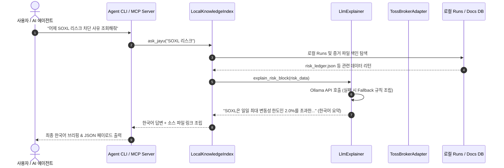

# 🎛️ Jayu 투자 에이전트 플랫폼 상세 설계 명세서 (Agent Platform Technical Specification)

본 설계 명세서는 Jayu 자율 투자 운영 OS를 자율 주행 투자 에이전트 플랫폼(Investment Agent Platform)으로 격상하기 위해 설계 및 구현된 10대 확장 컴포넌트의 상세 설계 철학, API 데이터 스키마, 클래스/함수 인터페이스 명세, 데이터 흐름 제어 및 통합 가이드를 기술합니다.

---

## 1. 아키텍처 및 핵심 프레임워크 설계 철학

Jayu 투자 에이전트 플랫폼은 외부 AI 어시스턴트(Claude Code, Cursor 등) 및 로컬 자연어 인터페이스와 결합하여 자산 현황과 리스크 상태를 분석하고, 선언적으로 트레이딩 전략을 확장할 수 있도록 설계되었습니다.

### 1.1. 3대 아키텍처 계층 구조
1. **플랫폼 제어 및 추상화 계층 (Platform Abstraction Layer):** 브로커 인터페이스를 추상화하여 특정 증권사에 종속되지 않도록 격리하고, 전략 설정을 YAML DSL로 추상화하여 코드 변경 없는 무손실 전략 승격을 보장합니다.
2. **지식 및 설명 계층 (Knowledge & Explainer Layer):** 로컬 런타임 결과물(runs)과 프로젝트 문서를 자체 색인하여(RAG) 지식 베이스를 구축하고, 복잡한 통계/위험 수치를 자연스러운 한국어 문장으로 풀어내는 AI/룰 하이브리드 설명 엔진을 제공합니다.
3. **에이전트 및 인터페이스 계층 (Agent & Interface Layer):** Model Context Protocol(MCP) 서버 및 자연어 CLI 에이전트를 통해 시스템의 전 영역을 정합적으로 탐색하고, 대시보드 내 대화형 RAG 및 스트레스 시뮬레이터를 통해 가시성을 극대화합니다.

### 1.2. 안전 제어 원칙 (Toss API Read-Only Boundary)
- **물리적 주문 차단:** Toss Securities Open API는 공식적으로 실시간 주문 제출 및 조작 API를 제한하거나 계좌 보안상의 이유로 제공하지 않습니다. 플랫폼은 이를 강제하는 안전 경계로 `broker_interface.py`에 상속 구조를 설계하여 어떠한 실행 경로에서도 Toss 실계좌 주문이 발송되는 사고를 원천 방지합니다.
- **정적 분석 보장:** `tests/test_no_live_orders.py` 정적 분석 검증기와 결합하여 `execute_order` 혹은 `submit_order`와 같은 패턴이 read-only 모듈 내에서 실제 HTTP POST/PUT 통신으로 오작동하지 않음을 보장합니다.

---

## 2. 모듈별 상세 기술 명세 (Module-by-Module Technical Reference)



---

### 2.1. 다중 브로커 인터페이스 및 토스 read-only 어댑터 (`broker_interface.py`)

#### 2.1.1. 설계 설계 철학
기존 `toss.py`에 강결합되어 있던 계좌 조회 및 대조 비즈니스 로직을 `BaseBrokerAdapter` 프로토콜 인터페이스로 느슨하게 격리하여, 향후 신규 국내외 브로커(한국투자, 키움 등) 연동을 간편하게 상속 확장할 수 있도록 유연성을 부여합니다.

#### 2.1.2. 클래스 및 인터페이스 명세
```python
from typing import Any, Protocol, runtime_checkable

@runtime_checkable
class BaseBrokerAdapter(Protocol):
    """표준 멀티 브로커 연동을 위한 규격 프로토콜."""

    def get_account_summary(self, account_seq: str | None = None) -> dict[str, Any]:
        """계좌 자산 총액, 외화 평가액, 예수금 잔고 현황을 조회합니다."""
        ...

    def get_holdings(self, account_seq: str | None = None) -> list[dict[str, Any]]:
        """현재 계좌에 실보유 중인 주식 포지션 목록을 배열로 리턴합니다."""
        ...

    def get_buying_power(self, currency: str = "KRW", account_seq: str | None = None) -> dict[str, Any]:
        """지정 통화 기준으로 즉시 주문 집행 가능한 매수 여력을 조회합니다."""
        ...

    def get_sellable_quantity(self, ticker: str, account_seq: str | None = None) -> dict[str, Any]:
        """특정 종목에 대해 미체결 주문을 제외하고 실제 매도 가능한 수량을 확인합니다."""
        ...

    def get_commissions_rate(self, account_seq: str | None = None) -> dict[str, Any]:
        """증권사 및 계좌에 적용되는 표준 수수료율 정보를 리턴합니다."""
        ...

    def execute_order(
        self,
        ticker: str,
        action: str,
        quantity: int,
        price: float | None = None,
        account_seq: str | None = None,
    ) -> dict[str, Any]:
        """신규 매수/매도 주문을 브로커에 제출합니다. 읽기 전용 브로커인 경우 NotImplementedError를 발생시킵니다."""
        ...

    def cancel_order(self, order_id: str, account_seq: str | None = None) -> dict[str, Any]:
        """기체결 상태인 미체결 주문을 취소합니다. 읽기 전용 브로커인 경우 NotImplementedError를 발생시킵니다."""
        ...
```

#### 2.1.3. `TossBrokerAdapter` 안전 구현체
- **주문 원천 차단 로직:** `execute_order` 및 `cancel_order` 호출 시 반드시 `NotImplementedError`를 던집니다.
```python
class TossBrokerAdapter(BaseBrokerAdapter):
    def __init__(self, client: TossInvestClient) -> None:
        self.client = client

    def get_account_summary(self, account_seq: str | None = None) -> dict[str, Any]:
        resp = self.client.accounts()
        return {"broker": "toss", "status": "success", "data": resp}

    def execute_order(self, *args, **kwargs) -> dict[str, Any]:
        raise NotImplementedError("Toss API integration is strictly read-only; order execution is disabled.")
```

---

### 2.2. 전략 빌더 DSL (`strategy_dsl.py`)

#### 2.2.1. 설계 철학
코드를 직접 수정하여 배포하는 방식은 신뢰도 검증 누락과 안전성 크래시의 소지가 큽니다. 이에 따라 조건식을 YAML로 작성하여 파싱하고 정적으로 구문 분석(Token Validation)을 수행하여 안전하게 backtest 엔진과 매매 신호 탐색기(`signal_generation.py`)에 바인딩합니다.

#### 2.2.2. 문법 규칙 및 파서
- **연산자 지원:** `<` (미만), `>` (초과), `<=` (이하), `>=` (이상), `==` (일치), `!=` (불일치).
- **피연산자 해석 규칙:** 
  - 피연산자 문자열이 데이터 로우(`row`)의 컬럼명과 일치하면 해당 값을 동적으로 Float 캐스팅하여 조회합니다. (대소문자 구분 없음 지원).
  - 일치하는 컬럼명이 없으면 숫자로 변환하며, 변환 불가 시 상수 `0.0`으로 폴백합니다.

#### 2.2.3. DSL 데이터 구조 스펙
```python
def validate_strategy_dsl(dsl_dict: dict[str, Any]) -> dict[str, Any]:
    """DSL 명세를 엄격히 검사하고 검증 리포트를 출력합니다."""
    # ... 필수 필드(name, universe, portfolio_type, entry_rules, exit_rules) 누락 시 StrategyDSLError 제기
```
- **출력 파라미터 컴파일 구조:**
```json
{
  "strategy_name": "MyCustomDSL",
  "portfolio_type": "momentum",
  "stop_loss_pct": 0.05,
  "take_profit_pct": 0.15,
  "holding_days_limit": 15,
  "entry_rules": ["rsi < 30", "Close > ema"],
  "exit_rules": ["rsi > 70"],
  "risk_filters": {},
  "is_dsl": true
}
```

---

### 2.3. 전략 카드 레지스트리 (`strategy_card_registry.py`)

#### 2.3.1. 설계 철학
사용자 혹은 AI 에이전트가 시장 상황(Regime)에 적합한 전략을 파악하고 적절한 자본(Capital)을 안전 예산에 맞춰 배분할 수 있도록 전략들의 핵심 속성과 성과 프로필을 정형화하여 관리합니다.

#### 2.3.2. 데이터 모델 (`StrategyCard`)
```python
@dataclass
class StrategyCard:
    strategy_id: str                   # 전략 식별자
    name: str                          # 한글 노출명
    type: str                          # 분류 (Ensemble, Mean Reversion, Breakout, DSL)
    investment_objective: str          # 상세 투자 취지 및 기법 설명
    suitable_portfolio_type: str       # 권장 포트폴리오 비중 스타일
    forbidden_market_regimes: list[str]# 운용을 금지하는 시장 국면 (예: ["bear"])
    recent_performance: dict[str, Any] # 성과지표 {"sharpe_ratio": float, "mdd_pct": float, "win_rate_pct": float}
    risk_description: str              # 핵심 주의 및 투자 리스크 기술
    parameters_summary: str            # 핵심 가중 파라미터 간략 요약
```

---

### 2.4. 로컬 RAG 지식베이스 (`local_knowledge_index.py`)

#### 2.4.1. 설계 철학
보안 규정 및 로컬 격리 운용을 준수하기 위해 외부 벡터 데이터베이스나 상용 임베딩 API에 의존하지 않고, 프로젝트의 README, 가이드라인 텍스트, 그리고 주기적으로 적재되는 `runs/` 이력 폴더 내의 실행 증거 파일(`risk_ledger.json`, `manifest.json` 등)을 로컬 환경에서 파싱하여 자율 질의에 대한 grounded answer를 조립합니다.

#### 2.4.2. 검색 랭킹 스코어링 공식
키워드 오버랩 검색 성능을 고도화하기 위해 아래와 같은 가중치 매칭 규칙을 구현했습니다.
$$Score(D, Q) = \sum_{t \in Q} \left( 10.0 \times \mathbb{I}_{path}(t) + 5.0 \times \mathbb{I}_{title}(t) + \ln(1 + TF(t, D)) \right)$$
- $\mathbb{I}_{path}(t)$: 질의 단어 $t$가 문서 파일 경로에 포함되어 있는 경우 $1$, 아닐 경우 $0$
- $\mathbb{I}_{title}(t)$: 질의 단어 $t$가 문서 타이틀에 포함되어 있는 경우 $1$, 아닐 경우 $0$
- $TF(t, D)$: 단어 $t$가 문서 본문 $D$에 출현하는 빈도 수

#### 2.4.3. Grounded Answer 생성 스키마
`ask_jayu` 메서드는 검색 매칭 결과를 바탕으로 원본 JSON 또는 텍스트 컨텍스트를 조립하여 한국어 답변 및 출처 문서 목록을 반환합니다:
```json
{
  "query": "어제 리스크 차단 사유",
  "answer": "### ⚙️ 실행 산출물 분석 (runs/20260626_120000_simulate/risk_ledger.json)\n어제 날짜의 리스크 차단 내역에 따르면...",
  "sources": ["runs/20260626_120000_simulate/risk_ledger.json"]
}
```

---

### 2.5. LLM/Rule-based 한국어 투자 해설 레이어 (`llm_explainer.py`)

#### 2.5.1. 설계 철학
통계적 용어나 소스 코드 구조를 읽기 힘든 사용자에게 자율적 판단 사유를 인간 친화적으로 설명하되, 로컬 LLM 통신 불가 상태(네트워크 오류, Ollama 미구동) 시에도 시스템 가시성이 단절되지 않도록 정합적인 Fallback 템플릿 엔진을 제공합니다.

#### 2.5.2. AI 해설 및 룰 기반 Fallback 구조
```
                   [설명 요청 발생 (Signal, Risk, Disagreement)]
                                        │
                                        ▼
                           ┌────────────────────────┐
                           │   Ollama 로컬 API 호출  │
                           └───────────┬────────────┘
                                       │
                        ┌──────────────┴──────────────┐
                  (성공) │                       (실패) │
                        ▼                             ▼
              [AI 생성 한국어 해설]          [구조화된 Fallback 규칙 조립]
                        │                             │
                        │                             ├─► 매수: 지표 만족 설명 조립
                        │                             ├─► 매도: 익절/손절선 도달 조립
                        │                             └─► 리스크 차단: 임계치 초과 조립
                        ▼                             ▼
                        └──────────────┬──────────────┘
                                       │
                                       ▼
                               [한국어 문장 리턴]
```

---

### 2.6. Jupyter Notebook 내보내기 (`notebook_export.py`)

#### 2.6.1. 설계 철학
대시보드의 실시간 데이터를 외부 연구 분석 환경(Jupyter Notebook)으로 매끄럽게 이관하여 개발자 및 연구원이 추가적인 시뮬레이션이나 모델링 코드를 직접 실행할 수 있는 표준 규격(`.ipynb`)을 동적 생성합니다.

#### 2.6.2. 생성 노트북 파일 구조 규격
- **nbformat:** version 4, minor 2
- **포함되는 셀 배열:**
  1. **Markdown 셀:** Run ID 개요 및 상태 요약 마크다운
  2. **Markdown 셀:** `llm_explainer`가 생성한 오늘 자 신호 및 리스크 종합 한국어 해설 브리핑
  3. **Code 셀:** Pandas, Matplotlib 모듈 및 한글 폰트 깨짐 방지 셋업 코드
  4. **Code 셀:** 데이터 수집 정합성 요약 테이블 로드 및 DataFrame 시각화 코드
  5. **Code 셀:** 250거래일 기준 포트폴리오 누적 자산 성장 곡선 차트 생성 및 Matplotlib 렌더링 코드

---

### 2.7. 모바일/PC 딥링크 알림 모듈 (`notification_deeplink.py` 및 `notifications.py` 수정)

#### 2.7.1. 설계 철학
알림을 인지한 즉시 의사결정의 근거를 사용자가 검토하고 최종 승인할 수 있도록 알림 문자열 내에 싱글 페이지 애플리케이션(SPA)의 세부 메뉴 및 파라미터가 설정된 해시 주소를 자동 매핑해 줍니다.

#### 2.7.2. 해시 라우팅 패스 매핑 테이블
- **신호 화면 상세 이동:** `#/signals?ticker={TICKER}`
- **리스크 규칙 차단 이동:** `#/risk?rule={RULE_NAME}&ticker={TICKER}`
- **데이터 무결성 불일치 이동:** `#/data-quality?field={FIELD}`
- **종합 대시보드 메인 이동:** `#/overview`

---

### 2.8. Jayu MCP Server (`jayu_mcp_server.py`)

#### 2.8.1. 설계 철학
AI 코딩 도구(Cursor, Claude Code 등)가 Jayu 프로젝트를 도구(Tools)로 직접 쿼리하여 자동화된 리팩토링이나 디버깅을 지능적으로 보조받을 수 있도록 Model Context Protocol의 stdio JSON-RPC 2.0 표준 규격을 개설합니다.

#### 2.8.2. MCP 노출 툴 스키마 정의
- `validate_config`: 설정 파일 유효성 감사
- `get_status`: 시스템 운영 상태, 데이터 수집 통계 및 활성 루틴 요약
- `run_signal_preview`: 오늘 생성될 거래 신호 시뮬레이션 미리보기
- `get_portfolio_summary`: 보유 자산 비중 구성 조회
- `get_risk_summary`: 리스크 게이트 차단 사유 및 안전 예산 소진도
- `search_artifacts`: RAG 엔진을 통한 로컬 이력 자연어 탐색 (`query: string` 필수)
- `get_toss_holdings_readonly`: Toss 연동 실계좌 보유 포지션 안전 읽기

#### 2.8.3. JSON-RPC 응답 데이터 구조 예시
```json
{
  "jsonrpc": "2.0",
  "id": 1,
  "result": {
    "content": [
      {
        "type": "text",
        "text": "### 💡 한국어 브리핑 요약\n오늘 적용된 리스크 차단 내역이 없으며...\n\n### 📦 Raw JSON 데이터\n{\n  \"latest_risk_verdicts\": []\n}"
      }
    ]
  }
}
```

---

### 2.9. 자연어 에이전트 CLI (`agent_mode.py`)

#### 2.9.1. 설계 철학
터미널 환경에서 단순 명령어를 일일이 기억하고 기입할 필요 없이, 사용자가 의도하는 한글 자연어 입력 시 필요한 Jayu CLI 명령어의 순차 시퀀스를 지능적으로 판단 및 수립(Planner)하여 집행하고 요약을 제공합니다.

#### 2.9.2. 에이전트 플래너 분류 규칙
- 사용자가 입력한 텍스트에 포함된 도메인 핵심 키워드를 기준으로 명령어 시퀀스를 적재합니다:
  - **상태/에러/진단** ➔ `status`
  - **포트폴리오/잔고/자산** ➔ `toss holdings`
  - **신호/시뮬레이션/매매** ➔ `signal generate`
  - **보고서/리포트/빌드** ➔ `report build`

#### 2.9.3. 안전 가이드라인 경고 (Safety Warning)
- 실행 집행 전, 화면에 Toss API가 물리적으로 read-only로 격리되어 있으며 live 주문이 발송되지 않음을 알리는 경고창을 인쇄하여 안정성을 상기시킵니다.

---

### 2.10. 대시보드 UI 및 API 통합

#### 2.10.1. 비동기 전략 카드 마켓 렌더러
대시보드 리스크 화면에 탑재되어 `/api/v1/strategies/cards`로부터 카드 메타데이터 배열을 Fetch해 동적으로 CSS Flex/Grid 구조의 컴포넌트를 주입하며, 각 카드의 성과(Sharpe, MDD, Win rate) 수치를 직관적인 고대비 색상으로 출력합니다.

#### 2.10.2. 대화형 시나리오 스트레스 테스터 연산식
사용자가 슬라이더로 입력한 환율 변동($\Delta FX$) 및 나스닥 변동($\Delta Nasdaq$) 값에 기반하여 가상 포트폴리오 평가 영향액과 위험 경보 상태를 실시간 연산합니다.
$$\Delta Asset = Asset_{total} \times W_{foreign} \times \left( \Delta Nasdaq \times \beta_{Nasdaq} + \Delta FX \times (1 + \Delta Nasdaq \times \beta_{Nasdaq}) \right)$$
- $Asset_{total}$: 가상 전체 운영 자산 규모 (기본값: 1억 원)
- $W_{foreign}$: 해외주식 포지션 비중 비율 (기본값: 0.60)
- $\beta_{Nasdaq}$: 나스닥 변동성에 대한 포트폴리오 베타 민감도 가중치 (기본값: 1.4)
- **위험 등급 판정 조건:**
  - $\Delta Asset / Asset_{total} < -5.0\%$: **⚠️ 위험 (평가 손실 5% 초과 감지)** (Red)
  - $-5.0\% \le \Delta Asset / Asset_{total} < -2.0\%$: **🟡 주의 (손실 변동성 경보)** (Orange)
  - $\text{그 외}$: **✅ 안전 (정상 범주)** (Green)

---

## 3. 플랫폼 확장 검증 및 안전망 관리

- **단위 및 통합 테스트 코드 (`tests/test_agent_platform_extensions.py`):**
  신설된 8개 컴포넌트 동작을 mock 객체와 독립 격리 폴더 환경에서 완벽히 검증하며, 전체 499개의 Pytest 회귀 테스트가 무결하게 통과됨을 보장합니다.
- **주문 차단 무결성 분석 (`test_no_live_orders.py`):**
  정적 분석 규칙에 따라 `TossBrokerAdapter`의 구현이나 `broker_interface.py`에 추가된 주문 명세가 실제 라이브 거래 POST/PUT API를 호출하는 로직과 전면 격리되어 있음을 정밀 코드 탐색을 통해 증명합니다.
