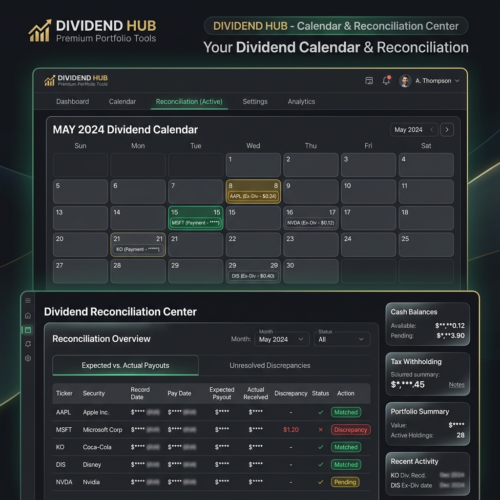
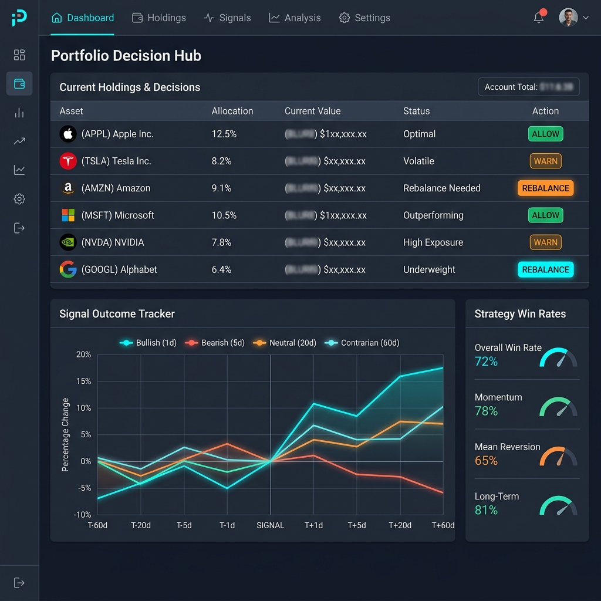
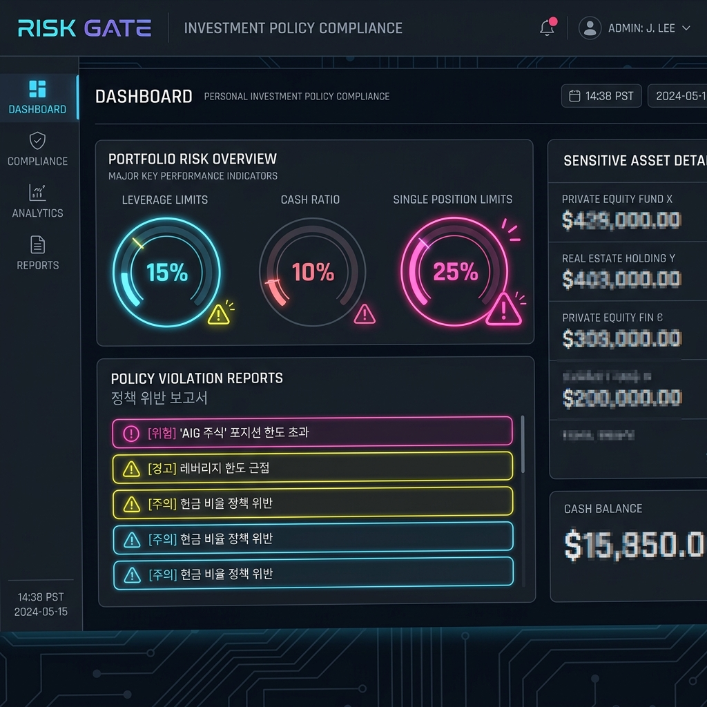

# Jayu (자유) 투자 운영 OS 사용자 매뉴얼

본 매뉴얼은 실계좌 기반 투자 의사결정 및 배당 관리 플랫폼인 **Jayu (자유)**의 주요 화면 구성과 조작 방법, 정책 설정 가이드를 설명합니다.

---

## 1. 개요 및 시스템 아키텍처

Jayu는 단순한 주식 시뮬레이터나 자동 매수·매도 봇이 아닙니다. 토스(Toss)의 **Read-Only API**를 활용하여 사용자의 실계좌 데이터를 안전하게 조회하고, 다중 데이터 소스 교차 검증, 개인 투자 정책 심사(Risk Gate), 예상-실제 배당 대사, 신호 사후 성과 추적을 원스톱으로 지원하는 **실계좌 의사결정 지원 시스템(OS)**입니다.

---

## 2. 화면 구성 및 주요 기능

### 1) 투자 홈 대시보드 (Overview)

대시보드의 진입점이며, 매일 아침 가장 먼저 확인해야 할 핵심 브리핑과 자산 변동 분석 결과가 최상단에 배치되어 있습니다.


*   **🛡️ JAYU HOME BRIEFING**: 포트폴리오 한도 초과, 배당 품질 미달, 가격 데이터 비동기 스케줄 경고 등 최우선 점검 사항을 최대 5가지의 한글 브리핑 카드로 요약해 줍니다.
*   **🔄 PORTFOLIO ACCOUNT DIFF**: 직전 계좌 스냅샷 대비 자산 변동의 원인을 **시장 가격 변동 기여분 (Price Effect)**과 **수량 및 매매 거래 기여분 (Quantity Effect)**으로 정밀 분석하여 보여줍니다.
*   **📊 핵심 운영 지표**: 데이터 검증 성공률, 리스크 게이트 준수율, Shadow 계좌 승격 조건 충족 여부 등이 원형 게이지 및 스코어 카드로 시각화됩니다.

---

### 2) 배당 대사 센터 (Dividend Reconciliation)

예상 배당금 일정 시뮬레이션과 실제 계좌에 입금된 내역을 비교 분석하여 누락이나 오차를 잡아내는 핵심 화면입니다.



*   **📅 배당 캘린더**: 월별 예상 세후 배당금과 배당락일(Ex-Dividend Date), 지급예정일(Payment Date) 일정을 캘린더 뷰로 한눈에 파악합니다.
*   **💵 배당 대사 내역**: 예상 배당금과 실제 입금 내역(`dividend_actual_receipts.csv`)을 1대1 매칭하여 **일치(matched), 누락(missing), 지연(delayed)** 상태와 오차 금액을 표 형식으로 일목요연하게 표시합니다.

---

### 3) 포트폴리오 의사결정 허브 및 신호 사후검증 (Decision Hub & Tracker)

당일 발생한 매수 신호와 계좌의 여유 현금, 포트폴리오 비중 규칙을 종합 바인딩하여 안전한 의사결정을 돕는 화면입니다.



*   **🎯 포트폴리오 의사결정 허브**:
    - 개별 보유 종목의 비중과 배당 품질을 감사하여 **"매수 가능 (allow)"**, **"보류 (warn)"**, **"리밸런싱 필요 (rebalance)"** 판정을 내립니다.
    - 단일 종목 한도 초과 시 즉각 "부분 매도(비중 조절)" 권장 액션을 제안합니다.
*   **📈 신호 사후검증 (Signal Outcome Tracker)**:
    - 발생한 매수 신호 시점의 진입 가격 대비 1일, 5일, 20일, 60일의 종가 변동 추이를 추적하여 각 전략별 실전 승률과 MDD 통계를 계산해 줍니다.

---

### 4) 리스크 예산 및 투자 정책 가드 (Risk Gate & Policy)

개인 투자 원칙 가이드라인의 준수 현황을 모니터링하고 보고서를 확인하는 화면입니다.



*   **🔒 리스크 예산 게이지**:
    - **최대 레버리지 비중 (15%)**
    - **최소 현금 비중 (10%)**
    - **단일 종목 최대 한도 (25%)**
    의 3대 자산 배분 통제 현황을 실시간 게이지 차트로 제공합니다.
*   **📋 개인 투자 원칙 위반 경고**:
    - 하루 최대 거래 제한, 손절 후 재진입 제한(5일 냉각기), 월간 누적 손실 예산(200만원) 위반 시 한글 보고서를 작성하고 경고 배지를 표출합니다.

---

## 3. 개인 투자 원칙 설정 및 관리

사용자의 투자 성향에 맞춘 자산 배분 및 거래 통제 규칙은 `configs/investment_policy.yaml` 파일에서 안전하게 격리되어 관리됩니다.

```yaml
policy:
  asset_allocation:
    max_leverage_ratio: 0.15          # 최대 레버리지 ETF 비중 한도
    min_cash_ratio: 0.10              # 최소 안전 현금 보유 비중
    max_single_position_ratio: 0.25   # 단일 종목 최대 보유 한도
  trading_restrictions:
    max_daily_trades: 5               # 일일 최대 주문 횟수
    cool_down_days_after_loss: 5      # 손절 후 동일 종목 재진입 제한 일수
    max_monthly_loss_krw: 2000000     # 월간 누적 최대 손실 한도
  dividend_quality:
    min_dividend_trust_score: 80.0    # 최소 준수 배당 신뢰 점수
```

---

## 4. MCP 및 에이전트 보안 가이드라인 (Agent Guardrail)

Jayu는 자연어 에이전트 및 MCP(Model Context Protocol) 환경에서 계좌 데이터를 안전하게 질의할 수 있도록 강력한 **보안 가이드라인(Guardrail)**이 장착되어 있습니다.

1.  **읽기 전용 권한 매트릭스 (Read-Only Matrix)**:
    - 에이전트가 `write_to_file`, `run_command` 등 쓰기/삭제/실행 관련 도구를 무단 호출하는 것을 원천 차단합니다.
2.  **명령어 인젝션 차단**:
    - 도구 인수에 `rm`, `bash`, `sh`, `powershell`, `curl`, `wget` 등의 위험한 shell 명령어 키워드가 포함될 경우 필터 단계에서 차단 에러를 반환합니다.
3.  **근거 Citation 필수 정책**:
    - 에이전트가 포트폴리오 및 자산 현황에 대해 답변할 때, 반드시 근거가 되는 로컬 아티팩트 링크(`file:///...`)를 마크다운에 명시하도록 검증합니다.
